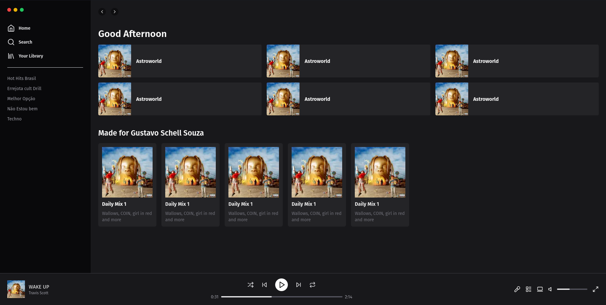

<h1 align="center"> Spotify Clone Interface #01 </h1>

Bem-vindo ao repositório do Clone do Spotify! Este é um projeto incrível que visa replicar as principais funcionalidades e a experiência do popular aplicativo de streaming de música.

  <a href="#-tecnologias">Tecnologias</a>&nbsp;&nbsp;&nbsp;|&nbsp;&nbsp;&nbsp;
  <a href="#-projeto">Projeto</a>&nbsp;&nbsp;&nbsp;|&nbsp;&nbsp;&nbsp;

  

 

  

## 🚀 Tecnologias

Esse projeto foi desenvolvido com as seguintes tecnologias:

- [Next](https://nextjs.org/)
- [Tailwindcss](Tailwindcss)
- [Typescript](https://www.typescriptlang.org/)
- [Node e NPM](https://nodejs.org/)

## 💻 Projeto

O Clone do Spotify é uma aplicação web que permite aos usuários explorar e reproduzir milhões de músicas de diferentes gêneros e artistas. Com recursos avançados de pesquisa, recomendações personalizadas e criação de playlists, o projeto busca proporcionar uma experiência musical excepcional aos usuários.

## Contribuição

Contribuições são bem-vindas! Se você deseja colaborar com o projeto, siga estas etapas:

1. Crie um fork deste repositório.
2. Crie uma nova branch com sua funcionalidade ou correção de bug: `git checkout -b minha-branch`.
3. Faça as alterações necessárias e commit as mudanças: `git commit -m 'Minha contribuição'`.
4. Envie as alterações para o seu fork: `git push origin minha-branch`.
5. Abra um pull request neste repositório, descrevendo suas alterações.

